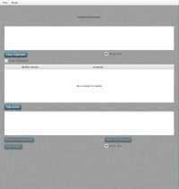
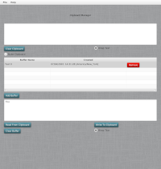
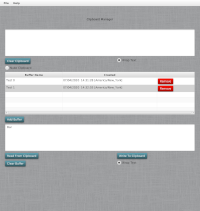

Clipboard Manager
======================================

### Table of Contents
1. [Usage](https://github.com/jeremymreed/multi-clipboard#usage)
2. [Requirements](https://github.com/jeremymreed/multi-clipboard#requirements)
3. [Building](https://github.com/jeremymreed/multi-clipboard#building)
4. [License](https://github.com/jeremymreed/multi-clipboard#license)

| No Buffers | Single Buffer | Multiple Buffers |
|---|---|---|
| [](https://github.com/jeremymreed/multi-clipboard/-/blob/feature/update-readme-with-thumbnails/images/multiclipboard-empty.png) | [](https://github.com/jeremymreed/multi-clipboard/-/blob/feature/update-readme-with-thumbnails/images/multiclipboard-single-buffer.png) | [](https://github.com/jeremymreed/multi-clipboard/-/blob/feature/update-readme-with-thumbnails/images/multiclipboard-multiple-buffers.png) |

# Usage:
This software allows you to emulate a multiclipboard.  It is capable of reading from and writing to your system clipboard.

On a Linux system, this is the CLIPBOARD selection.

The upper window contains the current CLIPBOARD contents.

You can clear the clipboard at any time by clicking 'Clear Clipboard'.

You can also toggle 'Wrap Text' to turn on / off line wrapping in the CLIPBOARD contents window.

There is a toggle for 'Nuke Clipboard'.  This will instruct the software to keep your clipboard clear.

The next window is a listing of buffers.  Initially this window will be empty.  You can click 'Add Buffer' to add a buffer.

Note: When adding buffers, you can click on the buffer name to change the name.  When you are done editing the buffer name, hit return to save the changes!  Hitting tab will not save the changes to the buffer.

Buffers are a place to store text temporarlly, and can be copied to/from the CLIPBOARD.

The window on the bottom displays the text of the currently selected buffer.

Below this window, are buttons to 'Read From Clipboard', 'Write To Clipboard', and 'Clear Buffer'.  These buttons should be self-explanatory.

Finally, there is another radio button to toggle 'Wrap Text' controlling line wrapping in the buffer contents window.

# Requirements:

This software will run in either Xorg or Wayland environments.

1. Java 8 and JavaFX 8.
2. Maven.

# Building:
This is a maven project.

To build: (This will compile, run tests, and build a JAR)
```
mvn package
```

To run tests:
```
mvn test
```

This will produce a jar in target/.  Move this jar wherever you want.
I use ~/Programs/Multiclipboard.

Use this script:
multiclipboard.sh:
```
#!/usr/bin/env bash

java -jar /path/to/jar/Multiclipboard-<version>-<hash>.jar
```

I place it in ~/.bin, and make it executable.

Running the software:
On Linux:
```
multiclipboard.sh
```

# License:
This software is licensed under the MIT License.
