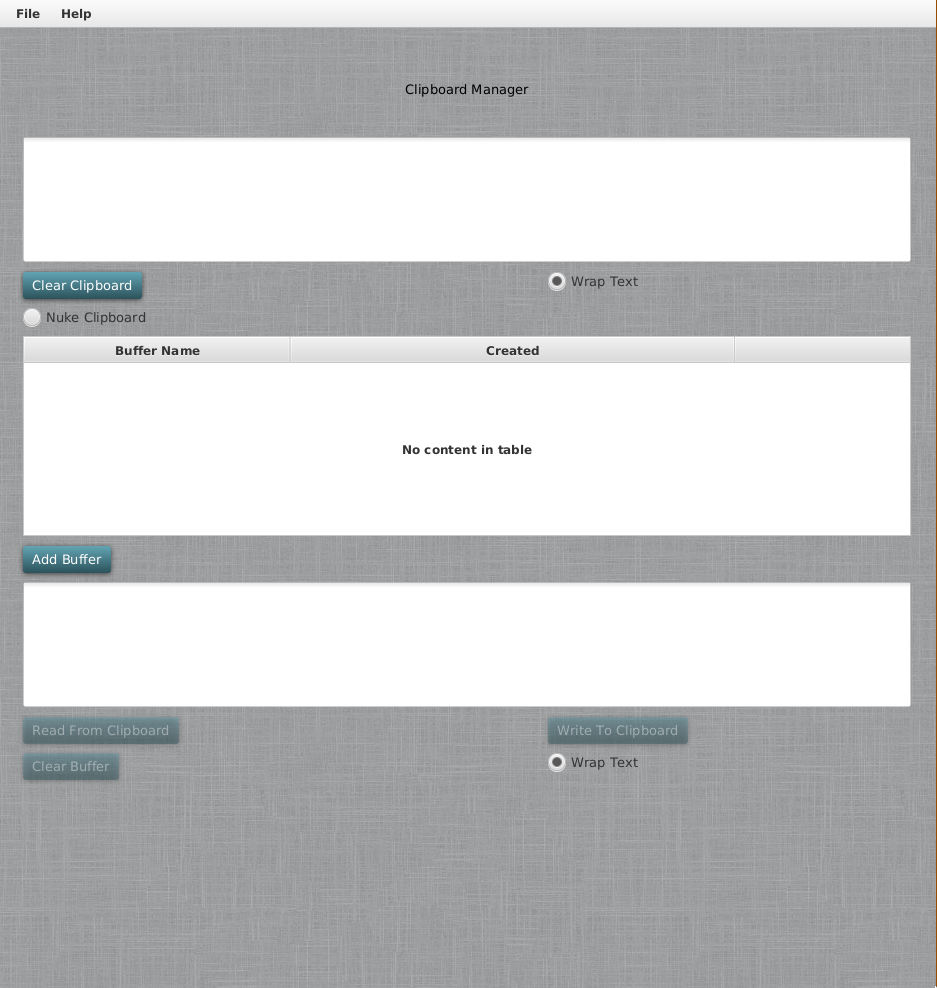

Clipboard Manager
======================================

### STATUS:
* master: [](https://gitlab.com/jeremymreed/multi-clipboard/commits/master)
* develop: [](https://gitlab.com/jeremymreed/multi-clipboard/commits/develop)

======================================
### Table of Contents
1. [Usage](https://gitlab.com/jeremymreed/multi-clipboard#usage)
2. [License](https://gitlab.com/jeremymreed/multi-clipboard#license)



# Usage:
This is a maven project.

To build:
```
mvn package
```

This will produce a jar in target/.  Move this jar wherever you want.
I use ~/Programs/Multiclipboard.

Use this script:
multiclipboard.sh:
```
#!/usr/bin/env bash

java -jar /path/to/jar/Multiclipboard-<version>-<hash>.jar
```

I place it in ~/.bin, and make it executable.

Running the software:
On Linux:
```
multiclipboard.sh
```

# License:
This software is licensed under the MIT License.
